# Database Blueprint & Architecture (Supabase)

> [!NOTE]
> Dieses Dokument wird automatisch durch das Backup-Skript [backup_supabase.py](file:///home/simple_simon/Codes/traveling_planet_earth/backup/backup_supabase.py) generiert.
> Jegliche manuellen Änderungen an dieser Datei werden beim nächsten Backup überschrieben.

## Entity-Relationship Diagramm (ERD)

Dieses Diagramm zeigt die Tabellen und ihre Beziehungen untereinander:

```mermaid
erDiagram
    community_boards {
        uuid board_id PK
        text name 
        text description 
        uuid created_by FK
        timestamp_tz created_at 
    }
    community_impulses {
        uuid impulse_id PK
        uuid visitor_id FK
        text content 
        text post_id FK
        bigint country_id FK
        timestamp_tz created_at 
        uuid board_id FK
        timestamp_tz updated_at 
    }
    community_reactions {
        uuid reaction_id PK
        uuid impulse_id FK
        uuid visitor_id FK
        text reaction_type 
        timestamp_tz created_at 
    }
    community_replies {
        uuid reply_id PK
        uuid impulse_id FK
        uuid visitor_id FK
        text content 
        timestamp_tz created_at 
        timestamp_tz updated_at 
    }
    community_visitors {
        uuid visitor_id PK
        text display_name 
        text recovery_code 
        integer visit_count 
        boolean is_banned 
        timestamp_tz last_active_at 
        timestamp_tz created_at 
        text avatar_id 
    }
    content_blocks {
        bigint block_id PK
        text post_id FK
        integer block_index 
        text block_type 
        text text_content 
        jsonb text_formatting 
        text text_subtype 
        text link_url 
        text link_title 
        text link_description 
        integer layout_row 
        integer layout_position 
        bigint media_id FK
        timestamp_tz created_at 
    }
    countries {
        bigint country_id PK
        text name 
        text name_de 
        character iso_code 
        character iso_code_3 
        text continent 
        date first_visited 
        date last_visited 
        text description 
        text notes 
        timestamp_tz created_at 
        timestamp_tz updated_at 
        text capital 
        float area 
        bigint population 
        float happiness_index 
        jsonb languages_share 
        jsonb religions_share 
        float gdp 
        text minorities 
        float gini 
        float hdi 
        text time_zone 
    }
    media {
        bigint media_id PK
        text post_id FK
        integer block_index 
        integer display_order 
        text media_type 
        text mime_type 
        text storage_path 
        text local_path 
        text original_url 
        text tumblr_url 
        integer width 
        integer height 
        bigint file_size 
        jsonb dominant_colors 
        jsonb exif_data 
        text camera_make 
        text camera_model 
        text lens 
        numeric aperture 
        numeric exposure_time 
        integer iso 
        integer focal_length 
        timestamp_tz photo_taken_at 
        integer duration_seconds 
        text provider 
        text alt_text 
        text caption 
        timestamp_tz created_at 
        array tags 
    }
    posts {
        text post_id PK
        timestamp_tz post_date 
        timestamp_tz created_at 
        timestamp_tz updated_at 
        bigint tumblr_timestamp 
        text slug 
        text original_url 
        text short_url 
        text state 
        integer note_count 
        text title 
        text summary 
        jsonb content_blocks 
        jsonb layout_info 
        text country_old 
        text city 
        text region 
        text location_name 
        array companions 
        numeric latitude 
        numeric longitude 
        text travel_mode 
        numeric distance_km 
        integer duration_days 
        text weather 
        text mood 
        array highlights 
        array tags 
        integer media_count 
        integer text_blocks_count 
        bigint country_id FK
        bigint trip_id FK
        timestamp_tz actual_date 
        user_defined coordinates 
        boolean is_enriched 
        jsonb reactions 
    }
    trip_countries {
        bigint trip_id PK
        bigint country_id PK
        integer visit_order 
        date entry_date 
        date exit_date 
        integer days_spent 
    }
    trips {
        bigint trip_id PK
        text trip_name 
        text description 
        date start_date 
        date end_date 
        array countries_old 
        numeric total_distance_km 
        array companions 
        timestamp_tz created_at 
        timestamp_tz updated_at 
    }
    posts ||--o{ media : "post_id"
    posts ||--o{ content_blocks : "post_id"
    media ||--o{ content_blocks : "media_id"
    countries ||--o{ posts : "country_id"
    trips ||--o{ posts : "trip_id"
    trips ||--o{ trip_countries : "trip_id"
    countries ||--o{ trip_countries : "country_id"
    community_visitors ||--o{ community_impulses : "visitor_id"
    posts ||--o{ community_impulses : "post_id"
    countries ||--o{ community_impulses : "country_id"
    community_impulses ||--o{ community_replies : "impulse_id"
    community_visitors ||--o{ community_replies : "visitor_id"
    community_impulses ||--o{ community_reactions : "impulse_id"
    community_visitors ||--o{ community_reactions : "visitor_id"
    community_visitors ||--o{ community_boards : "created_by"
    community_boards ||--o{ community_impulses : "board_id"
```



## Tabellendetails

### community_boards
- **Zeilenanzahl:** 3
- **Primärschlüssel:** `board_id`

| Spalte | Typ | Nullable | Standardwert | Beschreibung |
| --- | --- | --- | --- | --- |
| `board_id` | `uuid` | Nein | `gen_random_uuid()` | - |
| `name` | `text` | Nein | - | - |
| `description` | `text` | Ja | - | - |
| `created_by` | `uuid` | Ja | - | - |
| `created_at` | `timestamp with time zone` | Ja | `now()` | - |

**Fremdschlüssel-Beziehungen:**
- Spalte `created_by` verweist auf [`community_visitors.visitor_id`](#community_visitors) (`community_boards_created_by_fkey`)

---

### community_impulses
- **Zeilenanzahl:** 3
- **Primärschlüssel:** `impulse_id`

| Spalte | Typ | Nullable | Standardwert | Beschreibung |
| --- | --- | --- | --- | --- |
| `impulse_id` | `uuid` | Nein | `gen_random_uuid()` | - |
| `visitor_id` | `uuid` | Nein | - | - |
| `content` | `text` | Nein | - | - |
| `post_id` | `text` | Ja | - | - |
| `country_id` | `bigint` | Ja | - | - |
| `created_at` | `timestamp with time zone` | Ja | `now()` | - |
| `board_id` | `uuid` | Nein | - | - |
| `updated_at` | `timestamp with time zone` | Ja | - | - |

**Fremdschlüssel-Beziehungen:**
- Spalte `visitor_id` verweist auf [`community_visitors.visitor_id`](#community_visitors) (`community_impulses_visitor_id_fkey`)
- Spalte `post_id` verweist auf [`posts.post_id`](#posts) (`community_impulses_post_id_fkey`)
- Spalte `country_id` verweist auf [`countries.country_id`](#countries) (`community_impulses_country_id_fkey`)
- Spalte `board_id` verweist auf [`community_boards.board_id`](#community_boards) (`community_impulses_board_id_fkey`)

---

### community_reactions
- **Zeilenanzahl:** 2
- **Primärschlüssel:** `reaction_id`

| Spalte | Typ | Nullable | Standardwert | Beschreibung |
| --- | --- | --- | --- | --- |
| `reaction_id` | `uuid` | Nein | `gen_random_uuid()` | - |
| `impulse_id` | `uuid` | Nein | - | - |
| `visitor_id` | `uuid` | Nein | - | - |
| `reaction_type` | `text` | Nein | - | - |
| `created_at` | `timestamp with time zone` | Ja | `now()` | - |

**Fremdschlüssel-Beziehungen:**
- Spalte `impulse_id` verweist auf [`community_impulses.impulse_id`](#community_impulses) (`community_reactions_impulse_id_fkey`)
- Spalte `visitor_id` verweist auf [`community_visitors.visitor_id`](#community_visitors) (`community_reactions_visitor_id_fkey`)

---

### community_replies
- **Zeilenanzahl:** 1
- **Primärschlüssel:** `reply_id`

| Spalte | Typ | Nullable | Standardwert | Beschreibung |
| --- | --- | --- | --- | --- |
| `reply_id` | `uuid` | Nein | `gen_random_uuid()` | - |
| `impulse_id` | `uuid` | Nein | - | - |
| `visitor_id` | `uuid` | Nein | - | - |
| `content` | `text` | Nein | - | - |
| `created_at` | `timestamp with time zone` | Ja | `now()` | - |
| `updated_at` | `timestamp with time zone` | Ja | - | - |

**Fremdschlüssel-Beziehungen:**
- Spalte `impulse_id` verweist auf [`community_impulses.impulse_id`](#community_impulses) (`community_replies_impulse_id_fkey`)
- Spalte `visitor_id` verweist auf [`community_visitors.visitor_id`](#community_visitors) (`community_replies_visitor_id_fkey`)

---

### community_visitors
- **Zeilenanzahl:** 2
- **Primärschlüssel:** `visitor_id`

| Spalte | Typ | Nullable | Standardwert | Beschreibung |
| --- | --- | --- | --- | --- |
| `visitor_id` | `uuid` | Nein | `gen_random_uuid()` | - |
| `display_name` | `text` | Nein | - | - |
| `recovery_code` | `text` | Nein | - | - |
| `visit_count` | `integer` | Ja | `1` | - |
| `is_banned` | `boolean` | Ja | `false` | - |
| `last_active_at` | `timestamp with time zone` | Ja | `now()` | - |
| `created_at` | `timestamp with time zone` | Ja | `now()` | - |
| `avatar_id` | `text` | Nein | - | - |

---

### content_blocks
- **Zeilenanzahl:** 5716
- **Primärschlüssel:** `block_id`

| Spalte | Typ | Nullable | Standardwert | Beschreibung |
| --- | --- | --- | --- | --- |
| `block_id` | `bigint` | Nein | `nextval('content_blocks_block_id_seq'::regclass)` | - |
| `post_id` | `text` | Nein | - | - |
| `block_index` | `integer` | Nein | - | - |
| `block_type` | `text` | Nein | - | - |
| `text_content` | `text` | Ja | - | - |
| `text_formatting` | `jsonb` | Ja | - | - |
| `text_subtype` | `text` | Ja | - | - |
| `link_url` | `text` | Ja | - | - |
| `link_title` | `text` | Ja | - | - |
| `link_description` | `text` | Ja | - | - |
| `layout_row` | `integer` | Ja | - | - |
| `layout_position` | `integer` | Ja | - | - |
| `media_id` | `bigint` | Ja | - | - |
| `created_at` | `timestamp with time zone` | Ja | `now()` | - |

**Fremdschlüssel-Beziehungen:**
- Spalte `post_id` verweist auf [`posts.post_id`](#posts) (`content_blocks_post_id_fkey`)
- Spalte `media_id` verweist auf [`media.media_id`](#media) (`content_blocks_media_id_fkey`)

---

### countries
*Länder-Stammdaten*

- **Zeilenanzahl:** 59
- **Primärschlüssel:** `country_id`

| Spalte | Typ | Nullable | Standardwert | Beschreibung |
| --- | --- | --- | --- | --- |
| `country_id` | `bigint` | Nein | `nextval('countries_country_id_seq'::regclass)` | - |
| `name` | `text` | Nein | - | Offizieller Name (Englisch) |
| `name_de` | `text` | Ja | - | - |
| `iso_code` | `character(2)` | Ja | - | ISO 3166-1 Alpha-2 Code |
| `iso_code_3` | `character(3)` | Ja | - | - |
| `continent` | `text` | Ja | - | - |
| `first_visited` | `date` | Ja | - | - |
| `last_visited` | `date` | Ja | - | - |
| `description` | `text` | Ja | - | - |
| `notes` | `text` | Ja | - | - |
| `created_at` | `timestamp with time zone` | Ja | `now()` | - |
| `updated_at` | `timestamp with time zone` | Ja | `now()` | - |
| `capital` | `text` | Ja | - | - |
| `area` | `double precision` | Ja | - | - |
| `population` | `bigint` | Ja | - | - |
| `happiness_index` | `double precision` | Ja | - | - |
| `languages_share` | `jsonb` | Ja | - | - |
| `religions_share` | `jsonb` | Ja | - | - |
| `gdp` | `double precision` | Ja | - | - |
| `minorities` | `text` | Ja | - | - |
| `gini` | `double precision` | Ja | - | - |
| `hdi` | `double precision` | Ja | - | - |
| `time_zone` | `text` | Ja | - | - |

---

### media
- **Zeilenanzahl:** 3750
- **Primärschlüssel:** `media_id`

| Spalte | Typ | Nullable | Standardwert | Beschreibung |
| --- | --- | --- | --- | --- |
| `media_id` | `bigint` | Nein | `nextval('media_media_id_seq'::regclass)` | - |
| `post_id` | `text` | Nein | - | - |
| `block_index` | `integer` | Nein | - | - |
| `display_order` | `integer` | Ja | `0` | - |
| `media_type` | `text` | Nein | - | - |
| `mime_type` | `text` | Ja | - | - |
| `storage_path` | `text` | Ja | - | - |
| `local_path` | `text` | Ja | - | - |
| `original_url` | `text` | Nein | - | - |
| `tumblr_url` | `text` | Ja | - | - |
| `width` | `integer` | Ja | - | - |
| `height` | `integer` | Ja | - | - |
| `file_size` | `bigint` | Ja | - | - |
| `dominant_colors` | `jsonb` | Ja | - | - |
| `exif_data` | `jsonb` | Ja | - | - |
| `camera_make` | `text` | Ja | - | - |
| `camera_model` | `text` | Ja | - | - |
| `lens` | `text` | Ja | - | - |
| `aperture` | `numeric` | Ja | - | - |
| `exposure_time` | `numeric` | Ja | - | - |
| `iso` | `integer` | Ja | - | - |
| `focal_length` | `integer` | Ja | - | - |
| `photo_taken_at` | `timestamp with time zone` | Ja | - | - |
| `duration_seconds` | `integer` | Ja | - | - |
| `provider` | `text` | Ja | - | - |
| `alt_text` | `text` | Ja | - | - |
| `caption` | `text` | Ja | - | - |
| `created_at` | `timestamp with time zone` | Ja | `now()` | - |
| `tags` | `ARRAY` | Ja | - | - |

**Fremdschlüssel-Beziehungen:**
- Spalte `post_id` verweist auf [`posts.post_id`](#posts) (`media_post_id_fkey`)

---

### posts
- **Zeilenanzahl:** 655
- **Primärschlüssel:** `post_id`

| Spalte | Typ | Nullable | Standardwert | Beschreibung |
| --- | --- | --- | --- | --- |
| `post_id` | `text` | Nein | - | - |
| `post_date` | `timestamp with time zone` | Nein | - | - |
| `created_at` | `timestamp with time zone` | Ja | `now()` | - |
| `updated_at` | `timestamp with time zone` | Ja | `now()` | - |
| `tumblr_timestamp` | `bigint` | Ja | - | - |
| `slug` | `text` | Ja | - | - |
| `original_url` | `text` | Ja | - | - |
| `short_url` | `text` | Ja | - | - |
| `state` | `text` | Ja | `'published'::text` | - |
| `note_count` | `integer` | Ja | `0` | - |
| `title` | `text` | Ja | - | - |
| `summary` | `text` | Ja | - | - |
| `content_blocks` | `jsonb` | Nein | - | - |
| `layout_info` | `jsonb` | Ja | - | - |
| `country_old` | `text` | Ja | - | - |
| `city` | `text` | Ja | - | - |
| `region` | `text` | Ja | - | - |
| `location_name` | `text` | Ja | - | - |
| `companions` | `ARRAY` | Ja | - | - |
| `latitude` | `numeric` | Ja | - | - |
| `longitude` | `numeric` | Ja | - | - |
| `travel_mode` | `text` | Ja | - | - |
| `distance_km` | `numeric` | Ja | - | - |
| `duration_days` | `integer` | Ja | - | - |
| `weather` | `text` | Ja | - | - |
| `mood` | `text` | Ja | - | - |
| `highlights` | `ARRAY` | Ja | - | - |
| `tags` | `ARRAY` | Ja | - | - |
| `media_count` | `integer` | Ja | `0` | - |
| `text_blocks_count` | `integer` | Ja | `0` | - |
| `country_id` | `bigint` | Ja | - | Foreign Key zu countries - jeder Post gehört zu genau einem Land |
| `trip_id` | `bigint` | Ja | - | Foreign Key zu trips - jeder Post gehört zu genau einem Trip (optional) |
| `actual_date` | `timestamp with time zone` | Nein | - | - |
| `coordinates` | `USER-DEFINED` | Ja | - | - |
| `is_enriched` | `boolean` | Ja | `false` | - |
| `reactions` | `jsonb` | Ja | `'{}'::jsonb` | - |

**Fremdschlüssel-Beziehungen:**
- Spalte `country_id` verweist auf [`countries.country_id`](#countries) (`posts_country_id_fkey`)
- Spalte `trip_id` verweist auf [`trips.trip_id`](#trips) (`posts_trip_id_fkey`)

---

### trip_countries
*Many-to-Many: Ein Trip kann mehrere Länder besuchen*

- **Zeilenanzahl:** 48
- **Primärschlüssel:** `trip_id, country_id`

| Spalte | Typ | Nullable | Standardwert | Beschreibung |
| --- | --- | --- | --- | --- |
| `trip_id` | `bigint` | Nein | - | - |
| `country_id` | `bigint` | Nein | - | - |
| `visit_order` | `integer` | Ja | - | - |
| `entry_date` | `date` | Ja | - | - |
| `exit_date` | `date` | Ja | - | - |
| `days_spent` | `integer` | Ja | - | - |

**Fremdschlüssel-Beziehungen:**
- Spalte `trip_id` verweist auf [`trips.trip_id`](#trips) (`trip_countries_trip_id_fkey`)
- Spalte `country_id` verweist auf [`countries.country_id`](#countries) (`trip_countries_country_id_fkey`)

---

### trips
- **Zeilenanzahl:** 17
- **Primärschlüssel:** `trip_id`

| Spalte | Typ | Nullable | Standardwert | Beschreibung |
| --- | --- | --- | --- | --- |
| `trip_id` | `bigint` | Nein | `nextval('trips_trip_id_seq'::regclass)` | - |
| `trip_name` | `text` | Nein | - | - |
| `description` | `text` | Ja | - | - |
| `start_date` | `date` | Ja | - | - |
| `end_date` | `date` | Ja | - | - |
| `countries_old` | `ARRAY` | Ja | - | - |
| `total_distance_km` | `numeric` | Ja | - | - |
| `companions` | `ARRAY` | Ja | - | - |
| `created_at` | `timestamp with time zone` | Ja | `now()` | - |
| `updated_at` | `timestamp with time zone` | Ja | `now()` | - |

---

## Views (Datenbank-Ansichten)

Ansichten (Views) verhalten sich wie virtuelle Tabellen, die auf einer SQL-Abfrage basieren.

### countries_with_stats
- **Zeilenanzahl:** 59

**Spalten:**

| Spalte | Typ | Nullable |
| --- | --- | --- |
| `country_id` | `bigint` | Ja |
| `name` | `text` | Ja |
| `name_de` | `text` | Ja |
| `iso_code` | `character(2)` | Ja |
| `iso_code_3` | `character(3)` | Ja |
| `continent` | `text` | Ja |
| `first_visited` | `date` | Ja |
| `last_visited` | `date` | Ja |
| `description` | `text` | Ja |
| `notes` | `text` | Ja |
| `created_at` | `timestamp with time zone` | Ja |
| `updated_at` | `timestamp with time zone` | Ja |
| `capital` | `text` | Ja |
| `area` | `double precision` | Ja |
| `population` | `bigint` | Ja |
| `happiness_index` | `double precision` | Ja |
| `languages_share` | `jsonb` | Ja |
| `religions_share` | `jsonb` | Ja |
| `gdp` | `double precision` | Ja |
| `minorities` | `text` | Ja |
| `gini` | `double precision` | Ja |
| `hdi` | `double precision` | Ja |
| `time_zone` | `text` | Ja |
| `total_posts` | `bigint` | Ja |
| `first_post_date` | `timestamp with time zone` | Ja |
| `last_post_date` | `timestamp with time zone` | Ja |
| `trips` | `ARRAY` | Ja |

**SQL-Definition:**
```sql
CREATE OR REPLACE VIEW public.countries_with_stats AS
SELECT c.country_id,
    c.name,
    c.name_de,
    c.iso_code,
    c.iso_code_3,
    c.continent,
    c.first_visited,
    c.last_visited,
    c.description,
    c.notes,
    c.created_at,
    c.updated_at,
    c.capital,
    c.area,
    c.population,
    c.happiness_index,
    c.languages_share,
    c.religions_share,
    c.gdp,
    c.minorities,
    c.gini,
    c.hdi,
    c.time_zone,
    count(DISTINCT p.post_id) AS total_posts,
    min(p.actual_date) AS first_post_date,
    max(p.actual_date) AS last_post_date,
    array_agg(DISTINCT t.trip_name) FILTER (WHERE (t.trip_name IS NOT NULL)) AS trips
   FROM ((countries c
     LEFT JOIN posts p ON ((c.country_id = p.country_id)))
     LEFT JOIN trips t ON ((p.trip_id = t.trip_id)))
  GROUP BY c.country_id;
```

---

### posts_with_media
- **Zeilenanzahl:** 655

**Spalten:**

| Spalte | Typ | Nullable |
| --- | --- | --- |
| `post_id` | `text` | Ja |
| `post_date` | `timestamp with time zone` | Ja |
| `created_at` | `timestamp with time zone` | Ja |
| `updated_at` | `timestamp with time zone` | Ja |
| `tumblr_timestamp` | `bigint` | Ja |
| `slug` | `text` | Ja |
| `original_url` | `text` | Ja |
| `short_url` | `text` | Ja |
| `state` | `text` | Ja |
| `note_count` | `integer` | Ja |
| `title` | `text` | Ja |
| `summary` | `text` | Ja |
| `content_blocks` | `jsonb` | Ja |
| `layout_info` | `jsonb` | Ja |
| `country_old` | `text` | Ja |
| `city` | `text` | Ja |
| `region` | `text` | Ja |
| `location_name` | `text` | Ja |
| `companions` | `ARRAY` | Ja |
| `latitude` | `numeric` | Ja |
| `longitude` | `numeric` | Ja |
| `travel_mode` | `text` | Ja |
| `distance_km` | `numeric` | Ja |
| `duration_days` | `integer` | Ja |
| `weather` | `text` | Ja |
| `mood` | `text` | Ja |
| `highlights` | `ARRAY` | Ja |
| `tags` | `ARRAY` | Ja |
| `media_count` | `integer` | Ja |
| `text_blocks_count` | `integer` | Ja |
| `country_id` | `bigint` | Ja |
| `trip_id` | `bigint` | Ja |
| `actual_date` | `timestamp with time zone` | Ja |
| `total_media` | `bigint` | Ja |
| `image_count` | `bigint` | Ja |
| `video_count` | `bigint` | Ja |

**SQL-Definition:**
```sql
CREATE OR REPLACE VIEW public.posts_with_media AS
SELECT p.post_id,
    p.post_date,
    p.created_at,
    p.updated_at,
    p.tumblr_timestamp,
    p.slug,
    p.original_url,
    p.short_url,
    p.state,
    p.note_count,
    p.title,
    p.summary,
    p.content_blocks,
    p.layout_info,
    p.country_old,
    p.city,
    p.region,
    p.location_name,
    p.companions,
    p.latitude,
    p.longitude,
    p.travel_mode,
    p.distance_km,
    p.duration_days,
    p.weather,
    p.mood,
    p.highlights,
    p.tags,
    p.media_count,
    p.text_blocks_count,
    p.country_id,
    p.trip_id,
    p.actual_date,
    count(DISTINCT m.media_id) AS total_media,
    count(DISTINCT m.media_id) FILTER (WHERE (m.media_type = 'image'::text)) AS image_count,
    count(DISTINCT m.media_id) FILTER (WHERE (m.media_type = 'video'::text)) AS video_count
   FROM (posts p
     LEFT JOIN media m ON ((p.post_id = m.post_id)))
  GROUP BY p.post_id;
```

---

### posts_with_thumbnail
- **Zeilenanzahl:** 655

**Spalten:**

| Spalte | Typ | Nullable |
| --- | --- | --- |
| `post_id` | `text` | Ja |
| `post_date` | `timestamp with time zone` | Ja |
| `created_at` | `timestamp with time zone` | Ja |
| `updated_at` | `timestamp with time zone` | Ja |
| `tumblr_timestamp` | `bigint` | Ja |
| `slug` | `text` | Ja |
| `original_url` | `text` | Ja |
| `short_url` | `text` | Ja |
| `state` | `text` | Ja |
| `note_count` | `integer` | Ja |
| `title` | `text` | Ja |
| `summary` | `text` | Ja |
| `content_blocks` | `jsonb` | Ja |
| `layout_info` | `jsonb` | Ja |
| `country_old` | `text` | Ja |
| `city` | `text` | Ja |
| `region` | `text` | Ja |
| `location_name` | `text` | Ja |
| `companions` | `ARRAY` | Ja |
| `latitude` | `numeric` | Ja |
| `longitude` | `numeric` | Ja |
| `travel_mode` | `text` | Ja |
| `distance_km` | `numeric` | Ja |
| `duration_days` | `integer` | Ja |
| `weather` | `text` | Ja |
| `mood` | `text` | Ja |
| `highlights` | `ARRAY` | Ja |
| `tags` | `ARRAY` | Ja |
| `media_count` | `integer` | Ja |
| `text_blocks_count` | `integer` | Ja |
| `country_id` | `bigint` | Ja |
| `trip_id` | `bigint` | Ja |
| `actual_date` | `timestamp with time zone` | Ja |
| `thumbnail_path` | `text` | Ja |

**SQL-Definition:**
```sql
CREATE OR REPLACE VIEW public.posts_with_thumbnail AS
SELECT post_id,
    post_date,
    created_at,
    updated_at,
    tumblr_timestamp,
    slug,
    original_url,
    short_url,
    state,
    note_count,
    title,
    summary,
    content_blocks,
    layout_info,
    country_old,
    city,
    region,
    location_name,
    companions,
    latitude,
    longitude,
    travel_mode,
    distance_km,
    duration_days,
    weather,
    mood,
    highlights,
    tags,
    media_count,
    text_blocks_count,
    country_id,
    trip_id,
    actual_date,
    ( SELECT m.storage_path
           FROM media m
          WHERE ((m.post_id = p.post_id) AND (m.media_type = 'image'::text))
          ORDER BY m.block_index, m.display_order
         LIMIT 1) AS thumbnail_path
   FROM posts p;
```

---

### timeline
- **Zeilenanzahl:** 655

**Spalten:**

| Spalte | Typ | Nullable |
| --- | --- | --- |
| `post_id` | `text` | Ja |
| `post_date` | `timestamp with time zone` | Ja |
| `actual_date` | `timestamp with time zone` | Ja |
| `title` | `text` | Ja |
| `summary` | `text` | Ja |
| `country` | `text` | Ja |
| `country_code` | `character(2)` | Ja |
| `city` | `text` | Ja |
| `companions` | `ARRAY` | Ja |
| `tags` | `ARRAY` | Ja |
| `trip_name` | `text` | Ja |
| `media_count` | `bigint` | Ja |

**SQL-Definition:**
```sql
CREATE OR REPLACE VIEW public.timeline AS
SELECT p.post_id,
    p.post_date,
    p.actual_date,
    p.title,
    p.summary,
    c.name AS country,
    c.iso_code AS country_code,
    p.city,
    p.companions,
    p.tags,
    t.trip_name,
    count(DISTINCT m.media_id) AS media_count
   FROM (((posts p
     LEFT JOIN countries c ON ((p.country_id = c.country_id)))
     LEFT JOIN trips t ON ((p.trip_id = t.trip_id)))
     LEFT JOIN media m ON ((p.post_id = m.post_id)))
  GROUP BY p.post_id, c.name, c.iso_code, t.trip_name
  ORDER BY p.post_date DESC;
```

---

### trips_with_countries
- **Zeilenanzahl:** 17

**Spalten:**

| Spalte | Typ | Nullable |
| --- | --- | --- |
| `trip_id` | `bigint` | Ja |
| `trip_name` | `text` | Ja |
| `description` | `text` | Ja |
| `start_date` | `date` | Ja |
| `end_date` | `date` | Ja |
| `countries_old` | `ARRAY` | Ja |
| `total_distance_km` | `numeric` | Ja |
| `companions` | `ARRAY` | Ja |
| `created_at` | `timestamp with time zone` | Ja |
| `updated_at` | `timestamp with time zone` | Ja |
| `countries` | `ARRAY` | Ja |
| `country_codes` | `ARRAY` | Ja |
| `post_count` | `integer` | Ja |
| `title_images` | `ARRAY` | Ja |

**SQL-Definition:**
```sql
CREATE OR REPLACE VIEW public.trips_with_countries AS
SELECT trip_id,
    trip_name,
    description,
    start_date,
    end_date,
    countries_old,
    total_distance_km,
    companions,
    created_at,
    updated_at,
    ( SELECT array_agg(c.name ORDER BY tc.visit_order) AS array_agg
           FROM (trip_countries tc
             JOIN countries c ON ((tc.country_id = c.country_id)))
          WHERE (tc.trip_id = t.trip_id)) AS countries,
    ( SELECT array_agg(c.iso_code ORDER BY tc.visit_order) AS array_agg
           FROM (trip_countries tc
             JOIN countries c ON ((tc.country_id = c.country_id)))
          WHERE (tc.trip_id = t.trip_id)) AS country_codes,
    ( SELECT (count(p.post_id))::integer AS count
           FROM posts p
          WHERE (p.trip_id = t.trip_id)) AS post_count,
    COALESCE(( SELECT array_agg(DISTINCT ((tag.tag || '::'::text) || COALESCE(m.storage_path, m.original_url))) AS array_agg
           FROM (media m
             JOIN posts p2 ON ((m.post_id = p2.post_id))),
            LATERAL unnest(m.tags) tag(tag)
          WHERE ((p2.trip_id = t.trip_id) AND (tag.tag ~~ '#title%'::text))), ARRAY[]::text[]) AS title_images
   FROM trips t;
```

---

## Datenbankfunktionen (Stored Procedures)

Diese Funktionen werden direkt in PostgreSQL ausgeführt (z.B. für Trigger oder RPC-Aufrufe).

### set_coordinates_from_lat_lng
- **Argumente:** `Keine`
- **Rückgabetyp:** `trigger`

**SQL-Definition:**
```sql
CREATE OR REPLACE FUNCTION public.set_coordinates_from_lat_lng()
 RETURNS trigger
 LANGUAGE plpgsql
AS $function$
BEGIN
    IF NEW.latitude IS NOT NULL AND NEW.longitude IS NOT NULL THEN
        NEW.coordinates = ST_SetSRID(ST_MakePoint(NEW.longitude, NEW.latitude), 4326)::geography;
    END IF;
    RETURN NEW;
END;
$function$;
```

---

### sync_trip_companions
- **Argumente:** `Keine`
- **Rückgabetyp:** `trigger`

**SQL-Definition:**
```sql
CREATE OR REPLACE FUNCTION public.sync_trip_companions()
 RETURNS trigger
 LANGUAGE plpgsql
AS $function$
BEGIN
    -- Update the old trip companions (if any and if the trip changed or was removed)
    IF (TG_OP = 'UPDATE' OR TG_OP = 'DELETE') 
        AND OLD.trip_id IS NOT NULL 
        AND (TG_OP = 'DELETE' OR NEW.trip_id IS NULL OR OLD.trip_id != NEW.trip_id) 
    THEN
        UPDATE trips
        SET companions = (
            SELECT array_agg(DISTINCT c)
            FROM (
                SELECT unnest(companions) AS c
                FROM posts
                WHERE trip_id = OLD.trip_id AND companions IS NOT NULL
            ) sub
        )
        WHERE trip_id = OLD.trip_id;
    END IF;

    -- Update the new trip companions (if any)
    IF (TG_OP = 'INSERT' OR TG_OP = 'UPDATE') 
        AND NEW.trip_id IS NOT NULL 
    THEN
        UPDATE trips
        SET companions = (
            SELECT array_agg(DISTINCT c)
            FROM (
                SELECT unnest(companions) AS c
                FROM posts
                WHERE trip_id = NEW.trip_id AND companions IS NOT NULL
            ) sub
        )
        WHERE trip_id = NEW.trip_id;
    END IF;

    RETURN NULL;
END;
$function$;
```

---

### sync_trip_dates
- **Argumente:** `Keine`
- **Rückgabetyp:** `trigger`

**SQL-Definition:**
```sql
CREATE OR REPLACE FUNCTION public.sync_trip_dates()
 RETURNS trigger
 LANGUAGE plpgsql
AS $function$
BEGIN
    -- Update the old trip dates (if any and if the trip changed or was removed)
    IF (TG_OP = 'UPDATE' OR TG_OP = 'DELETE') 
        AND OLD.trip_id IS NOT NULL 
        AND (TG_OP = 'DELETE' OR NEW.trip_id IS NULL OR OLD.trip_id != NEW.trip_id) 
    THEN
        UPDATE trips
        SET 
            start_date = (
                SELECT MIN(actual_date::DATE)
                FROM posts
                WHERE trip_id = OLD.trip_id
            ),
            end_date = (
                SELECT MAX(actual_date::DATE)
                FROM posts
                WHERE trip_id = OLD.trip_id
            )
        WHERE trip_id = OLD.trip_id;
    END IF;

    -- Update the new trip dates (if any)
    IF (TG_OP = 'INSERT' OR TG_OP = 'UPDATE') 
        AND NEW.trip_id IS NOT NULL 
    THEN
        UPDATE trips
        SET 
            start_date = (
                SELECT MIN(actual_date::DATE)
                FROM posts
                WHERE trip_id = NEW.trip_id
            ),
            end_date = (
                SELECT MAX(actual_date::DATE)
                FROM posts
                WHERE trip_id = NEW.trip_id
            )
        WHERE trip_id = NEW.trip_id;
    END IF;

    RETURN NULL;
END;
$function$;
```

---

### update_country_stats
- **Argumente:** `Keine`
- **Rückgabetyp:** `trigger`

**SQL-Definition:**
```sql
CREATE OR REPLACE FUNCTION public.update_country_stats()
 RETURNS trigger
 LANGUAGE plpgsql
AS $function$
BEGIN
    UPDATE countries
    SET 
        first_visited = (
            SELECT MIN(actual_date::DATE) 
            FROM posts 
            WHERE country_id = NEW.country_id
        ),
        last_visited = (
            SELECT MAX(actual_date::DATE) 
            FROM posts 
            WHERE country_id = NEW.country_id
        )
    WHERE country_id = NEW.country_id;
    
    RETURN NEW;
END;
$function$;
```

---

### update_updated_at_column
- **Argumente:** `Keine`
- **Rückgabetyp:** `trigger`

**SQL-Definition:**
```sql
CREATE OR REPLACE FUNCTION public.update_updated_at_column()
 RETURNS trigger
 LANGUAGE plpgsql
AS $function$
BEGIN
    NEW.updated_at = NOW();
    RETURN NEW;
END;
$function$;
```

---

## Datenbank-Trigger

Trigger führen automatisch Funktionen aus, wenn bestimmte Ereignisse (INSERT, UPDATE, DELETE) auf Tabellen auftreten.

### countries_updated_at (auf Tabelle `countries`)

**Trigger-Statement:**
```sql
CREATE TRIGGER countries_updated_at BEFORE UPDATE ON public.countries FOR EACH ROW EXECUTE FUNCTION update_updated_at_column();
```

---

### posts_set_coordinates (auf Tabelle `posts`)

**Trigger-Statement:**
```sql
CREATE TRIGGER posts_set_coordinates BEFORE INSERT OR UPDATE ON public.posts FOR EACH ROW WHEN (((new.latitude IS NOT NULL) AND (new.longitude IS NOT NULL))) EXECUTE FUNCTION set_coordinates_from_lat_lng();
```

---

### posts_updated_at (auf Tabelle `posts`)

**Trigger-Statement:**
```sql
CREATE TRIGGER posts_updated_at BEFORE UPDATE ON public.posts FOR EACH ROW EXECUTE FUNCTION update_updated_at_column();
```

---

### trigger_sync_trip_companions (auf Tabelle `posts`)

**Trigger-Statement:**
```sql
CREATE TRIGGER trigger_sync_trip_companions AFTER INSERT OR DELETE OR UPDATE OF trip_id, companions ON public.posts FOR EACH ROW EXECUTE FUNCTION sync_trip_companions();
```

---

### trigger_sync_trip_dates (auf Tabelle `posts`)

**Trigger-Statement:**
```sql
CREATE TRIGGER trigger_sync_trip_dates AFTER INSERT OR DELETE OR UPDATE OF trip_id, actual_date ON public.posts FOR EACH ROW EXECUTE FUNCTION sync_trip_dates();
```

---

### trigger_update_country_stats (auf Tabelle `posts`)

**Trigger-Statement:**
```sql
CREATE TRIGGER trigger_update_country_stats AFTER INSERT OR UPDATE OF country_id ON public.posts FOR EACH ROW WHEN ((new.country_id IS NOT NULL)) EXECUTE FUNCTION update_country_stats();
```

---

### trips_updated_at (auf Tabelle `trips`)

**Trigger-Statement:**
```sql
CREATE TRIGGER trips_updated_at BEFORE UPDATE ON public.trips FOR EACH ROW EXECUTE FUNCTION update_updated_at_column();
```

---
